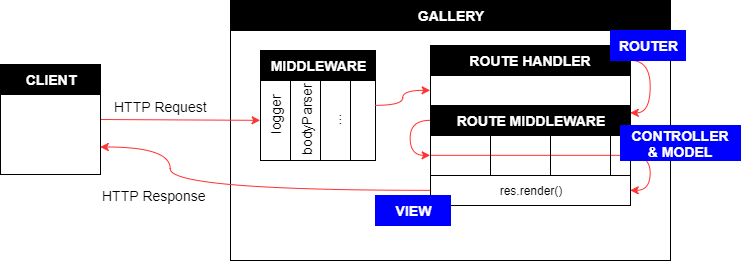
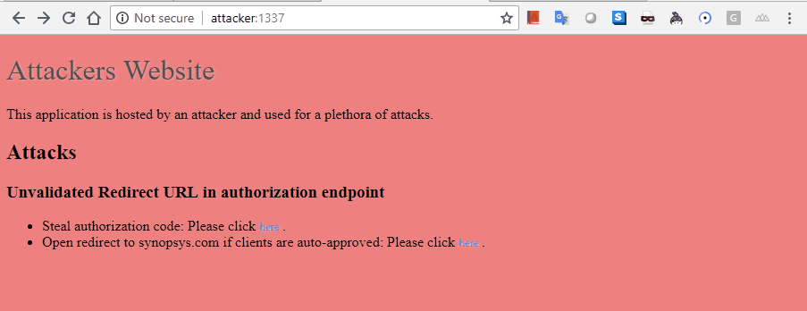
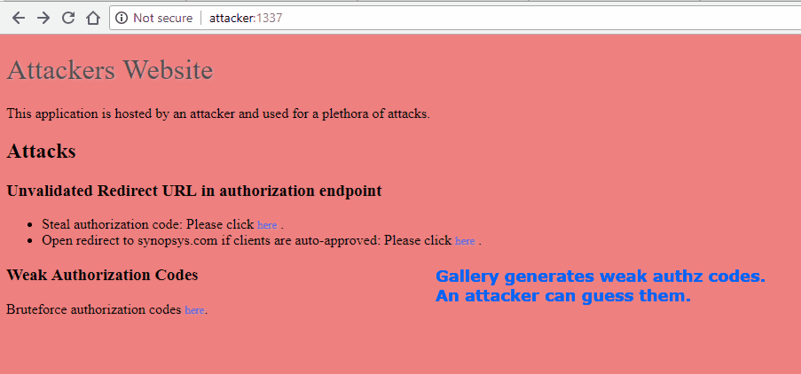
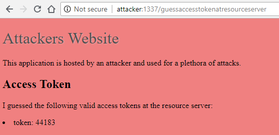
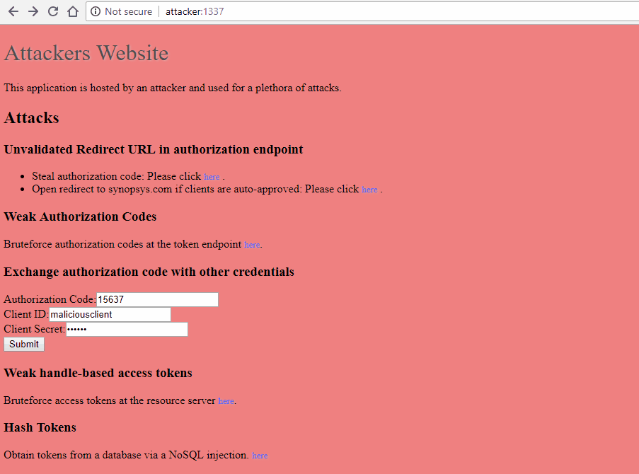

# Developer: Minor Design Decisions and Insecure Implementation

In this section, we present common security mistakes made when designing/implementing an OAuth 2.0 enabled application. This section lists a subset of what is listed in [RFC 6819](https://tools.ietf.org/html/rfc6819).

- [Developer: Minor Design Decisions and Insecure Implementation](#developer-minor-design-decisions-and-insecure-implementation)
  - [Implementation Details](#implementation-details)
  - [Authorization Endpoint: Validate the RedirectURI Parameter](#authorization-endpoint-validate-the-redirecturi-parameter)
  - [Authorization Endpoint: Generate Strong Authorization Codes](#authorization-endpoint-generate-strong-authorization-codes)
  - [Authorization Endpoint: Expire Unused Authorization Codes](#authorization-endpoint-expire-unused-authorization-codes)
  - [Token Endpoint: Invalidate Authorization Codes After Use](#token-endpoint-invalidate-authorization-codes-after-use)
  - [Token Endpoint: Bind the Authorization Code to the Client](#token-endpoint-bind-the-authorization-code-to-the-client)
  - [Token Endpoint: Generate Strong Handle-Based Access and Refresh Tokens](#token-endpoint-generate-strong-handle-based-access-and-refresh-tokens)
  - [Token Endpoint: Store Handle-Based Access and Refresh Tokens Securely](#token-endpoint-store-handle-based-access-and-refresh-tokens-securely)
  - [Token Endpoint: Expire Access and Refresh Tokens](#token-endpoint-expire-access-and-refresh-tokens)
  - [Token Endpoint: Store Client Secrets Securely](#token-endpoint-store-client-secrets-securely)
  - [Use Strong Client Secrets](#use-strong-client-secrets)
  - [Implement Rate-Limiting](#implement-rate-limiting)
  - [Token Endpoint: Bind Refresh Token to Client](#token-endpoint-bind-refresh-token-to-client)
  - [Resource Server: Reject Revoked Tokens](#resource-server-reject-revoked-tokens)
  - [Token Endpoint: Limit Token Scope](#token-endpoint-limit-token-scope)
  - [Resource Server: Validate Token Scope](#resource-server-validate-token-scope)
  - [OAuth 2.0 Client: CSRF](#oauth-20-client-csrf)
  - [OAuth 2.0 Client: Store Client Secrets Securely](#oauth-20-client-store-client-secrets-securely)
  - [OAuth 2.0 Client: Store Access and Refresh Tokens Securely](#oauth-20-client-store-access-and-refresh-tokens-securely)

## Implementation Details

 Feel free to skip to the [Security Considerations Section](#security-considerations) if you are not interested in implementation details. Read the [introductions](https://developer.mozilla.org/en-US/docs/Learn/Server-side/Express_Nodejs/Introduction) on the [Mozilla website](https://developer.mozilla.org/en-US/docs/Learn/Server-side/Express_Nodejs/Tutorial_local_library_website) to [understand](https://developer.mozilla.org/en-US/docs/Learn/Server-side/Express_Nodejs/skeleton_website) how to create a basic node.js application.

Our gallery application is structured like a typical MEAN stack application:

- it implements the ***[Model-View-Controller](https://en.wikipedia.org/wiki/Model%E2%80%93view%E2%80%93controller)*** pattern. The model is the central component that manages the data, logic, and rules of the application. The view is the component that generates the output to the user based on changes in the model; i.e. it consists of the pages/responses that we are going to send to the Client. The controller forms the glue between models and views: it queries the models for data and puts that data into views that is sent to clients (users). The model and controller are custom code, while for the views we use the default [`Pug` (`Jade`)](https://github.com/pugjs/pug) as view template engine.
- Besides the MVC pattern, express.js applications also use a ***[router](https://expressjs.com/en/guide/routing.html)*** that maps URIs to controller functions. Architecturally speaking, this may be part of the controller, but most express.js applications use a separate folder for that.  

The flow throughout our `express.js` gallery application is as follows. A *Client* makes an HTTP request to our gallery application. The express.js enabled gallery application first passes the request throughout various middleware functionality (plugins that extend the functionality of an express.js application) and then passes it to a route handler. The route handler parses the URI and gives the URI parameters to the implementation(s) associated with that route,  typically a call (in our controller) to our model, a call to a middleware function, or a list of calls to middleware functions or custom code. Once a response is ready, the result is given to the view engine. This engine renders the response that is given to the *Client*.



The source code of our Gallery application is structured like a regular express.js application. We created a  general ```app.js``` script that combines the main server. The routes that map URIs to its actual implementation are defined in the ```routes``` folder, the controllers are defined in the controllers folder, the models are defined in the models folder, and the views are defined in the views folder. The `package.json` file defines the application dependencies and other information, while the public folder defines any stylesheets, images, and third-party JavaScript libraries. The structure is thus as follows.

```bash
/gallery
    app.js
    package.json
    /controllers
    /models
    /node_modules
    /public
        /images
        /javascripts
        /stylesheets
            base.css
    /routes
        index.js
        users.js
    /views
        error.pug
        index.pug
        layout.pug
```

The main API of our gallery application is fairly simple. We offer an API for manipulating user profiles and one for manipulating a user's gallery. The API to manipulate a user profile consists of a GET, PUT, and DELETE against a URI with the unique username. These operations respectively get the user profile, modify the profile, or delete the profile. A POST against the main user route creates a new user.

```javascript
router.get('/users/:name', ... );
router.put('/users/:name', ...);
router.delete('/users/:name', ...);
router.post('/users', ...)
```

The API to manipulate a user's gallery consists of a GET and POST against the main gallery URI as well as a GET, POST, DELETE, and PUT against the URI of a specific picture. The GET and POST against the main gallery URI lists the meta-data of the uploaded pictures or creates a new picture respectively. The GET, PUT, and DELETE requests against a specific picture obtain that picture, update the meta-data of that picture, or delete that picture respectively.

```javascript
router.post('/photos', ...);
router.get('/photos',  ...);
router.get('/photos/:username', ...);
router.get('/photos/:username/:imageid/view', ...);
router.get('/photos/:username/:imageid', ...);
router.get('/photos/:username/:imageid/raw',...);
router.put('/photos/:username/:imageid', ...);
router.delete('/photos/:username/:imageid', ...);
```

We use the [oauth2orize package](https://github.com/jaredhanson/oauth2orize) to offer the above API towards OAuth 2.0 clients. To use oauth2orize, we include the library in the code (with `require`) and instantiate it with `createServer`. We register callback functions in this server. Our callback functions contain code to

- generate an authorization code. Our function `grantcode` is registered as a callback to `oauth2orize.grant.code`.
- exchange an authorization code for an access token. Our function `exchangecode` is registered as a callback to `oauth2orize.exhange.authorizationCode`.
- exchange a refresh token for an access token. Our function `refresh` is registered as a callback to `oauth2orize.exhange.refresh`.
- (de-)serialize clients. Our functions `serialize` and `deserialize` are registered to transform a client object into a `client_id` and obtain a client object given the `client_id`.

```javascript
//import the oauth2orize package
var oauth2orize = require('oauth2orize');
// create OAuth 2.0 server
var server = oauth2orize.createServer();
// Register serialialization and deserialization functions.
server.serializeClient(serialize);
server.deserializeClient(deserialize);
// Register supported grant types.
server.grant(oauth2orize.grant.code(grantcode)
);
// Exchange authorization codes for access tokens.
server.exchange(oauth2orize.exchange.authorizationCode(exchangecode));

// function to generate an authorization code
function grantcode() {...}
//function to exchange an authorization code for an access token
function exchangecode() {...}
//function to serialize a client
function serialize() {...}
//function to deserialize a client
function deserialize() {...}
```

## [Authorization Endpoint: Validate the RedirectURI Parameter](https://tools.ietf.org/html/rfc6819#section-4.2.4)

If the authorization server does not validate that the redirect URI belongs to the client, it is susceptible to two types of attacks.

- [Open Redirect](https://tools.ietf.org/html/rfc6819#section-4.2.4) enables attackers to redirect the victim to a site of their liking.
    
- Account hijacking by stealing authorization codes. If an attacker redirects to a site under their control, the authorization code - which is part of the URI - is given to them. They may be able to exchange it for an access token and thus get access to the user's resources (if the client credentials are compromised or not necessary).
    

To remediate this, validate whether the `redirect_uri` parameter is one the client provided during the registration process. The match should be an exact match as attackers will be able to bypass most validation code.

To validate this as a tester, do the following:

1. Capture the URL that the OAuth 2.0 client uses to talk with the authorization endpoint.  `http://gallery:3005/oauth/authorize?response_type=code&redirect_uri=http%3A%2F%2Fphotoprint%3A3000%2Fcallback&scope=view_gallery&client_id=photoprint`
2. Change the value of the redirect_uri parameter to one you control.  `http://gallery:3005/oauth/authorize?response_type=code&redirect_uri=http%3A%2F%2Fattacker%3A1337%2Fcallback&scope=view_gallery&client_id=photoprint`
    One can use many payloads for redirect URI, including but not limited to.
    - If the redirect URI accepts external URLs, such as accounts.google.com, then use a redirector in that external URL to redirect to any website [https://accounts.google.com/signout/chrome/landing?continue=https://appengine.google.com/_ah/logout?continue%3Dhttp://attacker:1337](https://accounts.google.com/signout/chrome/landing?continue=https://appengine.google.com/_ah/logout?continue%3Dhttp://attacker:1337)
    - Use any of the regular bypasses
        - `http://example.com%2f%2f.victim.com`
        - `http://example.com%5c%5c.victim.com`
        - `http://example.com%3F.victim.com`
        - `http://example.com%23.victim.com`
        - `http://victim.com:80%40example.com`
        - `http://victim.com%2eexample.com`

## [Authorization Endpoint: Generate Strong Authorization Codes](https://tools.ietf.org/html/rfc6819#section-4.4.1.3)

If the authorization codes are weak, an attacker may be able to guess them at the token endpoint. This is especially true if the client secret is compromised, not used, or not validated. 

To remediate this, generate authorization codes with a length of at least 128 bit using a secure pseudo-random number generator that is seeded properly. Most mature OAuth 2.0 frameworks implement this correctly.

## [Authorization Endpoint: Expire Unused Authorization Codes](https://tools.ietf.org/html/rfc6819#section-5.1.5.4)

Expiring unused authorization codes limits the window in which an attacker can use captured or guessed authorization codes.

To remediate this, expire authorization codes 15-30 minutes after they have been generated.

## [Token Endpoint: Invalidate Authorization Codes After Use](https://tools.ietf.org/html/rfc6819#section-5.1.5.4)

Invalidating used authorization codes limits the window in which an attacker can use captured or guessed authorization codes.

To remediate this, follow the OAuth 2.0 specification and delete authorization codes from the database after they have been used.

## [Token Endpoint: Bind the Authorization Code to the Client](https://tools.ietf.org/html/rfc6819#section-5.2.4.4)

An attacker can exchange captured or guessed authorization codes for access tokens by using the credentials for another, potentially malicious, client.


To remediate this, bind the authorization code to the [client ID]((https://tools.ietf.org/html/rfc6819#section-5.2.4.4)) and the [redirect URI](https://tools.ietf.org/html/rfc6819#section-5.2.4.5).

## [Token Endpoint: Generate Strong Handle-Based Access and Refresh Tokens](https://tools.ietf.org/html/rfc6819#section-5.1.4.2.2)

If the tokens are weak, an attacker may be able to guess them at the resource server or the token endpoint. 

To remediate this, generate tokens with a length of at least 128 bit using a secure pseudo-random number generator that is seeded properly. Most mature OAuth 2.0 frameworks implement this correctly.

## [Token Endpoint: Store Handle-Based Access and Refresh Tokens Securely](https://tools.ietf.org/html/rfc6819#section-4.5.2)

If the handle-based tokens are stored as plain text, an attacker may be able to obtain them from the database at the resource server or the token endpoint.



To remediate this, hash the tokens before storing them using a strong hashing algorithm. When validating the token, hash the incoming token and validate whether that hashed value exists in the database.

## [Token Endpoint: Expire Access and Refresh Tokens](https://tools.ietf.org/html/rfc6819#section-5.1.5.3)

Expiring access and refresh tokens limits the window in which an attacker can use captured or guessed tokens.

To remediate this, expire access tokens 15-30 minutes after they have been generated. Refresh tokens can be valid for much longer. The actual amount depends on the risk profile of the application.

## [Token Endpoint: Store Client Secrets Securely](https://tools.ietf.org/html/rfc6819#section-5.3.3)

If the client secrets are stored as plain text, an attacker may be able to obtain them from the database at the resource server or the token endpoint.

To remediate this, store the client secrets like you would store user passwords: hashed with a strong hashing algorithm such as bcrypt, scrypt, or pbkdf2. When validating the secret, hash the incoming secret and compare it against the one stored in the database for that client.

## Use Strong Client Secrets

If the client secrets are weak, an attacker may be able to guess them at the token endpoint.

To remediate this, generate secrets with a length of at least 128 bit using a secure pseudo-random number generator that is seeded properly. Most mature OAuth 2.0 frameworks implement this correctly.

## Implement Rate-Limiting

To prevent bruteforcing, OAuth 2.0 endpoints should implement rate limiting as it slows down an attacker.

## Token Endpoint: Bind Refresh Token to Client

If the binding between a refresh token and the client is not validated, a malicious client may be able to exchange captured or guessed refresh tokens for access tokens. This is especially problematic if the application allows automatic registration of clients.

To remediate this, do the following. Upon minting refresh tokens, store the client who they are issued for. Upon token exchange, validate whether the client that exchanges it (using the client ID) is the same as the client that obtained it.

## Resource Server: Reject Revoked Tokens

TODO

## Token Endpoint: Limit Token Scope

TODO

## Resource Server: Validate Token Scope

TODO

## OAuth 2.0 Client: CSRF

TODO

## OAuth 2.0 Client: Store Client Secrets Securely

If the client secrets are stored insecurely, an attacker may be able to obtain them.

To remediate this, store the secrets using secure storage offered by the technology stack (typically encrypted). Keep these secrets out of version repositories.

## OAuth 2.0 Client: Store Access and Refresh Tokens Securely

If the handle-based tokens are stored as plain text in a database, an attacker may be able to obtain them from the database at the client.

To remediate this, keep the access tokens in memory and store the refresh tokens using secure storage offered by the technology stack (typically encrypted).